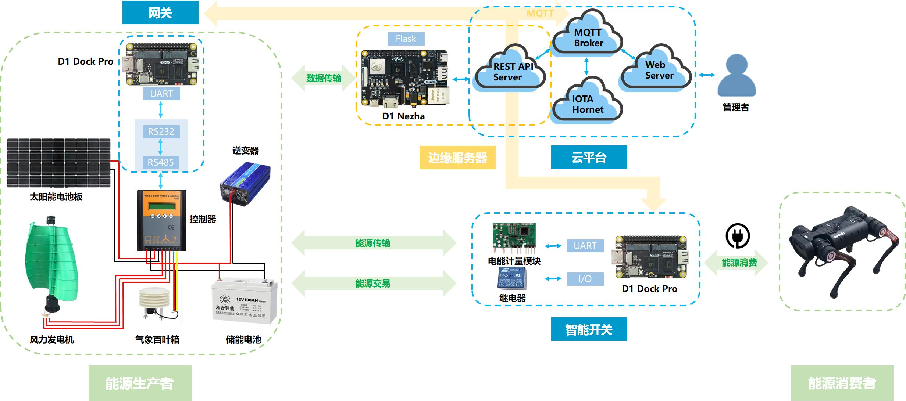

### An IoT & Blockchains Based Intelligent Distributed Renewable Clean Energy Management System with M2M Transaction Platform
### 分布式能源智慧管理和M2M交易系统

一、 本项目的系统架构图如下：

二、 本项目源码包括四个部分：
1. d1_dock_pro:
d1_dock_pro/http/app/src/app_main.c是接收传感器数据并通过MQTT/http方式上传云平台的代码，运行在D1 Dock Pro开发板上

2. d1_nezha:
d1_nezha/nezha_rest_server.py是rest服务器代码，运行在D1 Nezha开发板上(烧录debian镜像)

3. blockchain:
blockchain/iota_transaction.rs是区块链交易代码，运行在云端
放入 https://github.com/iotaledger/iota.rs/tree/production/examples 目录下编译即可

4. web:
web/src/views包括后台管理页面代码，运行在云端
